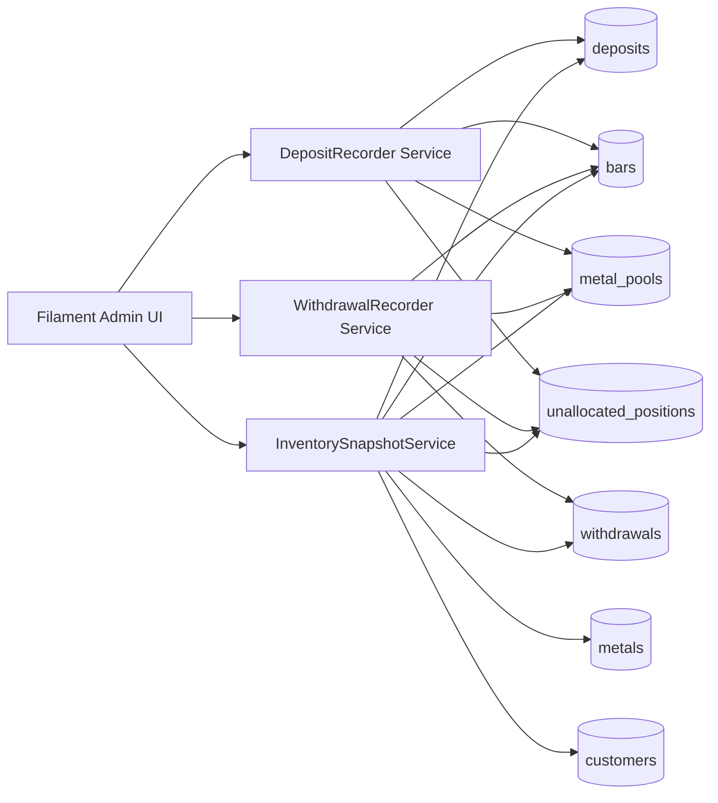

# Digital Asset Custody Platform

Minimal prototype for Bare Metals Pvt to manage precious-metal custody workflows across allocated and unallocated storage models.

## Assessment Deliverables Check

- Working application: Completed (Laravel 13 + Filament 5 admin panel).
- Modern UI for key flows: Completed (dashboard, customers, market prices, deposits, withdrawals, inventory views).
- Customer accounts: Completed.
- Deposits: Completed.
- Withdrawals: Completed.
- Asset valuation: Completed (live value derived from current metal prices; snapshots stored on transactions).
- Two storage models: Completed.
- Gold support with extensibility to silver/platinum: Completed (AU, AG, PT demo data and model support).
- Architecture sketch + data model: Included in this README.
- At least 5 edge cases + handling: Included in this README.
- GitHub repository with incremental commits: Not verifiable from this local workspace (no `.git` metadata available here).

## Why Filament For This Assessment

Filament was chosen because this is a small project and the fastest way to deliver a reliable working product within assessment time constraints.

For long-term scalability, the recommended direction is:

- Next.js frontend for richer UX, frontend scaling, and independent deployment.
- Laravel as an API-driven backend (auth, business rules, custody ledger, valuation).
- Clear backend/frontend separation for team scaling and multi-client channels (web, mobile, partner integrations).

## Tech Stack

- PHP 8.4
- Laravel 13
- Filament 5 + Livewire 4
- Tailwind CSS 4
- SQLite (default for local assessment setup)
- Pest 4 for testing

## Setup Instructions

1. Install dependencies and bootstrap project:

```bash
composer run setup
```

2. Seed demo data:

```bash
php artisan db:seed --no-interaction
```

3. Start development services:

```bash
composer run dev
```

4. Log in at the Filament panel (`/`) with:

- Email: `admin@admin.com`
- Password: `password`

## Key Functional Flows

- Create customers with account/storage profiles.
- Maintain metal market prices (Gold/Silver/Platinum).
- Record deposits:
  - Allocated (institutional): bar serials + bar weights.
  - Unallocated (retail): pooled quantity in kg.
- Record withdrawals:
  - Allocated: withdraw selected active bars.
  - Unallocated: withdraw quantity from pooled holdings.
- View dashboard and inventory summaries for custody totals and valuation.

## Architecture Sketch



## Data Model (Core Tables)

- `customers`: account profile (`Institutional` / `Retail`) and default storage type.
- `metals`: master list (code, name, current price).
- `deposits`: immutable deposit ledger entries with value/price snapshots.
- `withdrawals`: immutable withdrawal ledger entries with value/price snapshots.
- `bars`: allocated bar-level custody tracking (serial, weight, withdrawal linkage).
- `metal_pools`: aggregate totals per metal for unallocated pools.
- `unallocated_positions`: customer ownership units per metal pool.

## Assumptions And Architecture Decisions

- Customer type drives storage behavior:
  - Institutional => Allocated.
  - Retail => Unallocated.
- Transaction rows store price/value snapshots for auditable historical records.
- Current valuations use latest `metals.price` (dashboard/inventory live value).
- Unallocated ownership is tracked with units to preserve proportional ownership when pool composition changes.
- Filament resources are intentionally create-only for deposits/withdrawals (no edit/delete mutation flows).

## Edge Cases And Handling

1. Duplicate bar serials in same allocated deposit.
- Handling: Validation rejects duplicate serials before write.

2. Bar serial already exists globally.
- Handling: Validation rejects insert to maintain unique custody identity.

3. Allocated deposit submitted without bars.
- Handling: Validation exception; transaction not created.

4. Allocated withdrawal submitted without selected bars.
- Handling: Validation exception; transaction not created.

5. Attempt to withdraw bars not owned/available for that customer+metal.
- Handling: Availability query check; validation exception.

6. Unallocated withdrawal exceeds available net quantity.
- Handling: Pool/position balance check prevents over-withdrawal.

7. Invalid quantities (zero/negative) on deposit/withdrawal.
- Handling: Numeric `gt:0` validation and explicit guard clauses.

8. Withdrawal/deposit reference sequencing consistency.
- Handling: sequence numbers and generated reference format (`DEP-####`, `WDR-####`) with tests.

## API Calls

This assessment implementation is UI-first through Filament and does not currently expose a public API surface.

For the recommended long-term architecture (Next.js + Laravel API), typical endpoints would be:

- `GET /api/v1/metals`
- `POST /api/v1/deposits`
- `POST /api/v1/withdrawals`
- `GET /api/v1/inventory`

## Running Tests

```bash
php artisan test --compact
```

Targeted examples:

```bash
php artisan test --compact tests/Feature/DepositCreationTest.php
php artisan test --compact tests/Feature/WithdrawalCreationTest.php
```
